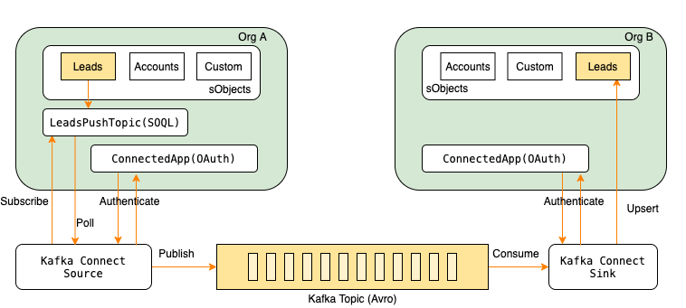
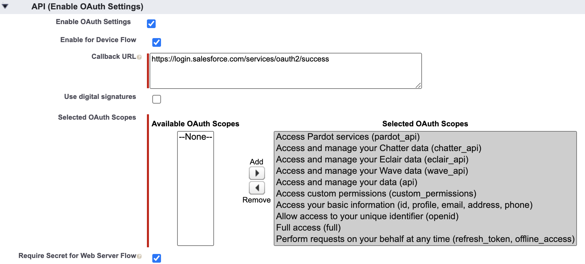
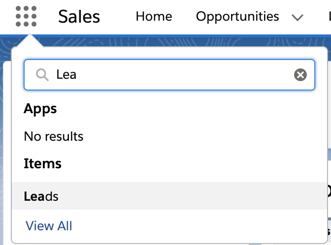
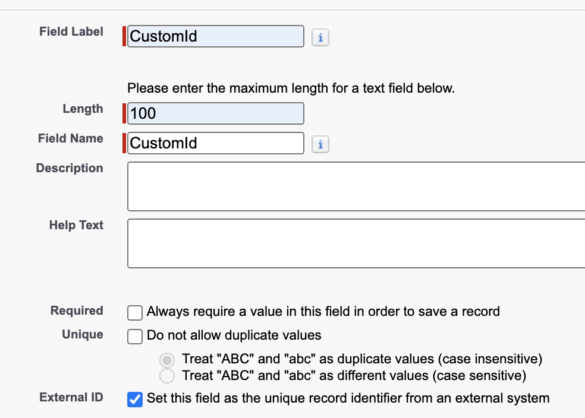

Recently, I have been trying to develop quick proof of concept using salesforce-kafka connector provided by confluent. 

Although, documentation available at [confluent](https://docs.confluent.io/current/connect/kafka-connect-salesforce/index.html) is comprehensive but it still lacks bit of information. Hence, I thought of sharing this blog with working example.

In this blog post, we are going to synchronize the object from one salesforce org to another org using salesforce-kafka connector.

Below diagram depicts the scenario and components required to complete the poc.



- We need two salesforce org logins. User will insert/update object in org A and kafka-connect will synchronize it in org B.
- In salesforce, there are already many inbuilt objects available; also, we can create the custom objects. We will use **Leads** object in this poc.
- We need to create PushTopic using SOQL in org A. With this setup, client can subscribe to PushTopic and any changes made to Leads object will be notified to client.
- Clients have to authenticate themselves before accessing the salesforce objects. Connected App generates neccessory credentials like secret key, access key using which clients will authenticate.
- Kafka connect source connector will subscribe to PushTopic and authenticate itself using credentials generated by connected app. Once it recieves the message, it will publish the event message in Avro format to Kafka topic.
- Kafka connect sink connector consumes the messages from same Kafka topic and perform the upsert on Leads object in org B.
- Sink connector will require credentials for authentication as well, hence we need to create the Connected App in org B as well.

## Initial Setup
Lets do some inital setup and installation before we run actual poc.

### Salesforce Org A
- Create new org with Developer/Unlimited/Enterprise edition. Don't create org with Professional edition as you cannot deploy custom apex code on professional edition.
- Verify your account
- Check your email inbox. In case you don't find email with your security token, click on profile picture -> settings -> My Personal Information -> Reset My Security Token.
- You will receive the security token on your email. Note down the security token.
- Click on Set up icon  on top right.
- Search "App" in "Search Setup" textbox and click on "App Manager"
- Enter required fields and select "Enable OAuth Settings"
- Select "Enable for Device Flow",  select All OAuth Scopes and Click on "next/save".

- Note down "secret key" and "access key"
- Lets create PushTopic for Leads Object
- Go to Setup -> Developer Console
- Open Apex Code Editor. On mac, use CMD+E shortcut.
- Execute below code
```java
PushTopic pushTopic = new PushTopic();
pushTopic.Name = 'LeadsPushTopic';
pushTopic.Query = 'SELECT Id, Name, FirstName, LastName, Company FROM Lead';
pushTopic.ApiVersion = 49.0;
pushTopic.NotifyForOperationCreate = true;
pushTopic.NotifyForOperationUpdate = true;
pushTopic.NotifyForOperationUndelete = true;
pushTopic.NotifyForOperationDelete = true;
pushTopic.NotifyForFields = 'Referenced';
insert pushTopic;
```
- You can choose any number of fields you want but make sure you select all mandatory fields.
- For Leads object mandatory fields are - Id, LastName and Compnay.

We are done with set up of org A. Lets move to org B.

### Salesforce Org B
- Follow the same steps as above except you don't have to create PushTopic in org B
- Note: You can use same email, just specify different username for salesforce account.

### Confluent Platform
- Download the confluent tar
```bash
wget https://packages.confluent.io/archive/5.5/confluent-5.5.0-2.12.tar.gz
```

- Make sure Java8 or Java11 is installed on your machine and JAVA_HOME is set.
- Unarchieve the confluent tar file and update the $PATH to include "$confluent5.5/bin"
```bash
cat ~/.bash_profile
export CONFLUENT_HOME=<path-to-confluent>
export PATH="${CONFLUENT_HOME}/bin:$PATH"
```
- Install the confluent salesforce connector.
```bash
confluent-hub install confluentinc/kafka-connect-salesforce:1.5.9
```
- Note: Don't use version 1.6.4, which is broken. I have already raised the defect with confluent team.
- Start the confluent platform services.
```bash
confluent local start
```

## Proof of Concept
### *Source Connector*
#### __Config file__
Create below config file (salesforce-pushtopic-lead-source-config.json) 
and replace credentials that you saved previously.
```json
{
     "name": "lead-pushtopic",
     "config": {
         "connector.class" : "io.confluent.salesforce.SalesforcePushTopicSourceConnector",
         "tasks.max" : "1",
         "kafka.topic" : "sfdc-pushtopic-leads",
         "salesforce.object" : "Lead",
         "salesforce.push.topic.name" : "LeadsPushTopic",
         "salesforce.username" : "<org_A_username>",
         "salesforce.password" : "<password>",
         "salesforce.password.token" : "<security_token>",
         "salesforce.consumer.key" : "<connected_app_consumer_key>",
         "salesforce.consumer.secret" : "<connected_app_secret_key>",
         "salesforce.initial.start" : "all",
	     "salesforce.instance": "https://login.salesforce.com",
         "confluent.topic.bootstrap.servers": "localhost:9092",
         "confluent.topic.replication.factor": "1"
     }
 }
```
#### __Fork the source connector__
```bash
confluent local load lead-pushtopic -- -d salesforce-pushtopic-lead-source-config.json
```
#### __Kafka connect logs__
You can check the connect logs using below command.
```bash
confluent local log connect -- -f
```
#### __Salesforce console__
- Login to Salesforce org A
- Open Leads Item from home page 
- Add one entry into Leads

#### __Validate the source connector__
- Once you add new records in Leads object, you should see data in kafka topic in avro format.
- Use kafka-avro-consumer to see message.
```bash
kafka-avro-console-consumer --bootstrap-server localhost:9092 --from-beginning --topic sfdc-pushtopic-leads
```
- Record should look like something below with additional fields of Lead object.
```bash
{
	"Id": "00Q3V000002o9aiUAA",
	"LastName": {
		"string": "Barapatre"
	},
	"FirstName": {
		"string": "Pari"
	},
	"Salutation": null,
	"Name": {
		"string": "Pari Barapatre"
	},
	"Company": {
		"string": "XYZ"
	},
	"_ObjectType": {
		"string": "Lead"
	},
	"_EventType": {
		"string": "created"
	}
}
```
- If you don't any see record populated in kafka-topic, check the kafka-connect logs.

### *Sink Connector*
#### __Config file__
Create config file (salesforce-sobject-leads-sink-config.properties)
 and replace credentials that you saved previously.

 Here we are using "properties" file instead of json. You can use json file as well. Confluent supports both json and properties file.
```properties
name=sink-leads
connector.class=io.confluent.salesforce.SalesforceSObjectSinkConnector
tasks.max=1
topics=sfdc-pushtopic-leads
salesforce.object=Lead
"salesforce.username" : "<org_A_username>",
"salesforce.password" : "<password>",
"salesforce.password.token" : "<security_token>",
"salesforce.consumer.key" : "<connected_app_consumer_key>",
"salesforce.consumer.secret" : "<connected_app_secret_key>",
salesforce.ignore.fields=CleanStatus
salesforce.ignore.reference.fields=true
salesforce.custom.id.field.name=CustomId__c
salesforce.use.custom.id.field=true
salesforce.sink.object.operation=upsert
override.event.type=true
confluent.topic.bootstrap.servers=localhost:9092
confluent.topic.replication.factor=1
```
There are three major differences in sink config from source config.
- We don't need salesforce.push.topic.name in sink config
- salesforce.custom.id.field.name property required for kafka connect to identify the record.
  Id field is maintained by salesforce and cannot be overriden. Hence, we need extra custom field which will be set by kafka-connect as OrgA_Lead_Id field before upserting record to OrgB_Lead object. 
- salesforce.sink.object.operation property specifies the operation we intended to perform.

#### __Salesforce console__
As mentioned above, we now have to create custom field in Leads object of org B.
- Login to org B salesforce console.
- Go to Set Up -> Object Manager -> Lead -> Fields & Relationship -> New
- Select 'text' field -> Next -> Name the field, Set it as "External Field" and Next->Next->Save



#### __Fork the sink connector__
```bash
confluent local load lead-sink -- -d salesforce-sobject-leads-sink-config.properties
```
#### __Kafka connect logs__
You can check the connect logs using below command.
```bash
confluent local log connect -- -f
```

#### __Validate the sink connector__
- Login to Salesforce org B
- Open Leads Item from home page 
- You should see one entry from org A
- Edit/Add record in org A and it should appear in org B in blink of an eye.


## Clean up
Run below command to stop all services and delete data.
```bash
confluent local destroy
```