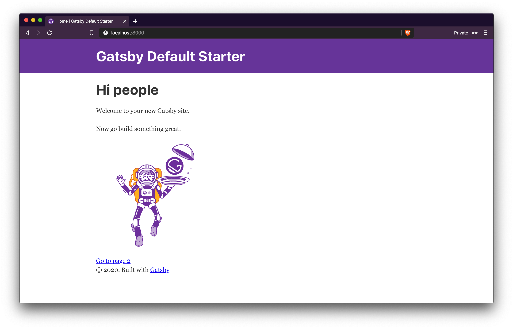
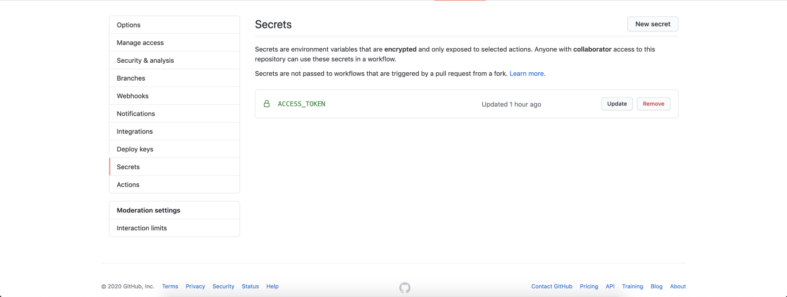

Starting your blog is a tough job, you have to come up with unique name for the blog, think about the blog hosting and a setup. Most of the people will give up until this point and either leave the blogging idea or start writing on medium/linkedin platforms. The same thing has happened with me.

So when we thought of starting our blog we obviously came up with the simple idea of starting it on Medium or Linkedin. But as an engineer instead of using third party platform we thought why not to host our own blog. We stumbled upon various platforms like WordPress, tumbler etc, but along with our own hosting we also wanted a clean blog website like Medium and a super fast performance as we will mostly be loading static content.

And then we found the solution that fitted exactly what we were looking for. That's the **[Gatsby](https://www.gatsbyjs.com/)**.

Gatsby is a ReactJS based opensource javascript framework with performance, scalability and security built in.

Gatsby allows you to write in Markdown language, that is easy to learn and write. If you have previously written Github documentation you would be aware with Markdown. Gatsby picks these markdown files and coverts them in to static html pages, which are used to serve blog. Gatsby is capable of doing much more, but here we will be talking about creating a blog website using Gatsby.

While working as a Software Engineer, Backend engineer and Data engineer it was very rare occasion to touch the front end stuff, that was one more reason to host our own blog and that too with Gatsby.

In this blog post I am writing  my learnings about setting up a gatsby blog, hosting it on a Github for free as a github pages. And then apply CI/CD to build and deploy your new blog posts.

So lets start with setting up a blog using Gastby.

###Environment Setup

To start setting up Gatsby, we will need to install node and npm. You can find installation steps [here.](https://docs.npmjs.com/downloading-and-installing-node-js-and-npm)

Then you need to install a gatsby-cli:

```

# npm install -g gatsby-cli
```

Now, you can create a new blog using existing gatsby templates

```

# create a
$ gatsby new blog https://github.com/gatsbyjs/gatsby-starter-blog

# change the working directory
cd blog

# start the development server
$ gatsby develop
```

Thats it, now you have your blog setup as a local development environment. Open up a new tab in your browser and navigate to [http://localhost:8000](http://localhost:8000)/



**Create a blog post**

Create a folder "first_post" under the content -> blog. And then create a markdown file "first_post.md"

```

├── content
    ├── blog
        ├── first_post.md


```

Now you need to add the content to the "first_post.md" file.

```

---
path: /blog/first-post
date: 2020-10-25
summary: This is my first post summary
tags: [my, first, post]
title: Hello World!!! This is my first gatsby post
---
The first blog post using gatsby. Gatsby is so awesome.
```

You need to add the "front-matter" at the start of your post. In the above example it is marked between dashes. This is the metadata about the post is being written,  like post date, summary and tags.

The **path** parameter of the front-matter is the most important. This will be the part of the url for the blogpost, so it needs to be unique. Gatsby reads this path and creates new page from it.

**Add your personal info:**

Open gatsby-config.js and edit personal details like author name, siteUrl, blog title etc.
You can change the profile by copying file under _content/assets/_ and  rename it to _profile-pic.png._

###Github Pages

_Before deploying our blog to github pages, lets go through how the github pages works._
_[Github Pages](https://pages.github.com/) is a service provided by github where you can setup your static websites directly from github repos._

_Github allows two types of static websites, one that is associate with github accounts and another project site i.e a site associated with repository. We need to create a project site in our case._

_Github pages looks for the content under_ **_gh-pages_** _branch to launch the website._

###Deploy to Github Pages:

Make sure that you have a git client installed.

```

$ git remote add  origin https://github.com/<github-username>/<repo-name>.git

# check remote
$ git remote -v

# it will look like this
> origin  https://github.com/username/repo.git (fetch)
> origin  https://github.com/username/repo.git (push)
```

We will use **dev** branch for a local development and the **"gh-pages"** branch will be used to deploy static pages.

Now install the gh-pages plugin to integrate gatsby site with GitHub pages.

```

npm install gh-pages
```

Now add the github repository name to your _gatsby-config.js._ **_Lets assum that your github repo is gatsby-project_**

```

module.exports = {
pathPrefix: "/gatsby_project",
}
```

Next, add a custom command deploy to your package.json file.

```

{
  "scripts": {
    "deploy": "gatsby build --prefix-paths && gh-pages -d public"
  }
}


```

This creates a deploy command which creates a static version of your site with prefix "gatsby-project". Then pushes the static  pages under generated public directory using gh-pages plugin.

Now, run the following script to build the blog website and push it to GitHub.

```

npm run deploy
```

This will publish the static content of your blog to the branch gh-pages.

###Activate Github pages:

1.  Go to your repository on <a href="http://github.com" rev="en_rl_none">github.com</a>
2.  Visit settings tab
3.  Search for "Github Pages"
4.  Select the branch "gh-pages"
5.  Now your blog site will be available under:username.github.com/gatsby_project

Now you can view your published content on:
username.github.io/gatsby_project

###Use a custom sub-domain:
You can associate your custom domain with your github pages repo. You just need to follow two simple steps:

1.  Configure github pages to use a custom domain:
    1. Go to the repository settings as followed in above step.
    2. Under the github pages section, you can add the custom domain name.
    3. Alternatively, you can add a CNAME file to the root of the repo with custom domain name mentioned in it.
2.  Update DNS of your domain to point to Github pages:
    1. You need to create a CNAME record which will point your domain to the github pages url.

You can find the [detailed instructions](https://help.github.com/en/github/working-with-github-pages/managing-a-custom-domain-for-your-github-pages-site) to link your gh pages with your domain.

###Continuous deployment with Github Actions:

Using Github actions you can automate your blog publishing.

_“GitHub Actions is your workflow: built by you, run by us.” — [The GitHub Blog](https://github.blog/2018-10-16-future-of-software/)_
We are going to use Gatsby Publish plugin for deployment automation.

1. Add the action to workflows yaml file:

   1. Create a&nbsp; .github/workflows directory under your repo
   2. add your action to a YAML file under the workflows directory

   ```
   name: Gatsby Publish

   on:
   push:
   branches: [ master ]

   jobs:
   build:
   runs-on: ubuntu-latest
   steps:
   - uses: actions/checkout@v2
   - name: Gatsby Publish
   uses: enriikke/gatsby-gh-pages-action@v2.1.1
   with:
   	access-token: ${{ secrets.ACCESS_TOKEN }}
   	deploy-branch: gh-pages
   	gatsby-args: --prefix-paths
   ```

2. Give access to workflow:

You need to give access to your repository to the workflow.

1. Go to Github settings
2. Secrets
3. Set <b><span style="color:rgb(41, 41, 41);">ACCESS_TOKEN </b><span style="color:rgb(41, 41, 41);">environment variable to a personal github token



With all this setup done, you are ready to trigger your first build by merging to the master branch of the repo.

To summarize, here we created a blazingly fast website using a Gatsby, published it to Github pages, linked the github pages to your custom domain and then used continuous deployment to automate publishing of new blog article after merging with a master.
