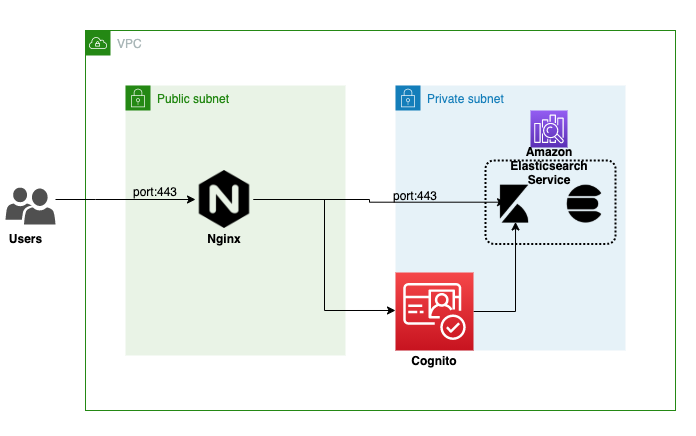

Amazon elasticsearch service is a popular choice for many aws clients for log analytics and visualization use cases. One common scenario is to have elasticsearch (indexing engine) only accessible within vpc and kibana (visualization engine) to be available over the internet through an authentication mechanism. 

Amazon elasticsearch service is a combo of elasticsearch and kibana, and we cannot provision two components separately. However, the aws team provided the hack to achieve the desired setup using Nginx and Cognito authentication.

Detailed documentation available at [aws](https://aws.amazon.com/premiumsupport/knowledge-center/kibana-outside-vpc-nginx-elasticsearch/). I referred the same documentation when I first launched the elasticsearch service, but it is quite a lengthy process to get it running. Hence, I thought of creating a Terraform IaC script, handy, and prod ready for deployment. 

We can also use AWS CloudFormation to create an IaC script, but I like the terraform simplicity and philosophy.

Below diagram shows the components and communication between each other.

- vpc and subnets to restrict the access of components
- elasticsearch service to be created within a private subnet
- cognito service(user pool and identity pool) which is used by elasticsearch service for authentication
- nginx instance will be placed in public subnet, which will act as a proxy for kibana access.
- security groups - kibana is only accessible through nginx over 443 port, and nginx public dns will be accessible over internet from port 443.

Terraform code is available at [github](https://github.com/pariksheet/terraform-aws-elasticsearch)

Terraform quick code walkthrough:
- project structure
    - commons
        - confiugure_nginx.sh 
            <p> An userdata script which installs and configures the nginx server. </p>
        - nginx.conf
            <p> Nginx configuration file referred by nginx script. </p>
    - main
        - main.tf
            <p> Launcher terraform script. </p>
        - vars.tf
            <p> List of variables referred in the terraform main script. </p>
        - terraform.tfvars
            <p> Variable values to be passed to terraform main script. </p>
    - modules
        - elasticsearch
            <p> Module consists of three sub modules. </p>
            - cognito
                <p> Create user pool and indentity pool</p>
            - elasticsearch_domain
                <p> Create elasticsearch domain with cognito authentication. </p>
            - nginx
                <p> Launch nginx instance and configure it to access kibana. </p>
        - vpc
            - vpc_base
                <p> Create vpc, subnets, route tables and internet gatway </p>
            - vpc_sg
                <p> Create security groups and ingress/egress rules </p>
- input variables
``` terraform variable "AWS_REGION" { description = "aws region" }
variable "PREFIX" { description = "Typically project name" }
variable "ENV" { description = "Environment Name" }
variable "SUBNET" { description = "VPC CIDR : 10.{var.SUBNET}.0.0/22"}
variable "INSTANCE_KEY_PATH" { description = "path of instance pem file" }
variable "NGINX_INSTANCE" { description = "instance type of nginx"}
variable "ES_INSTANCE" { description = "instance type of elasticsearch"}
variable "ES_VOLUME_GB" { description = "instance volume(gb) of elasticsearch"}
variable "ES_ENCRYPTION" { description = "true/false"}
```
- output variables
``` terraform
elasticsearch = {
  "es_arn" = "arn:aws:es:eu-west-1:856753410642:domain/blog-dev-elastic-search"
  "es_endpoint" = "vpc-blog-dev-elastic-search-wpeo7jzj3s76bgr3porui5e3x4.eu-west-1.es.amazonaws.com"
  "kibana_public_url" = "https://ec2-54-74-236-213.eu-west-1.compute.amazonaws.com"
  "kibana_vpc_url" = "https://vpc-blog-dev-elastic-search-wpeo7jzj3s76bgr3porui5e3x4.eu-west-1.es.amazonaws.com/_plugin/kibana/"
  "user_pool" = "BLOG_DEV_USER_POOL"
}
nginx = {
  "private_ip" = "10.33.0.142"
  "public_ip" = "54.74.236.213"
  "ssh_cmd" = "ssh -i ./keypair/nginx-instance ec2-user@i-08fc027f1db5542fc"
}
```
- execution of script
```bash
terraform apply
```

This blog post did not cover terraform basics on how to write each component. There is good material available over web. I have created a bootcamp for terraform beginner, here is the [github](https://github.com/pariksheet/terraform-bootcamp) link.

Feel free to ask any specific question over comment section.

Cheers. Happy Coding...!!!

